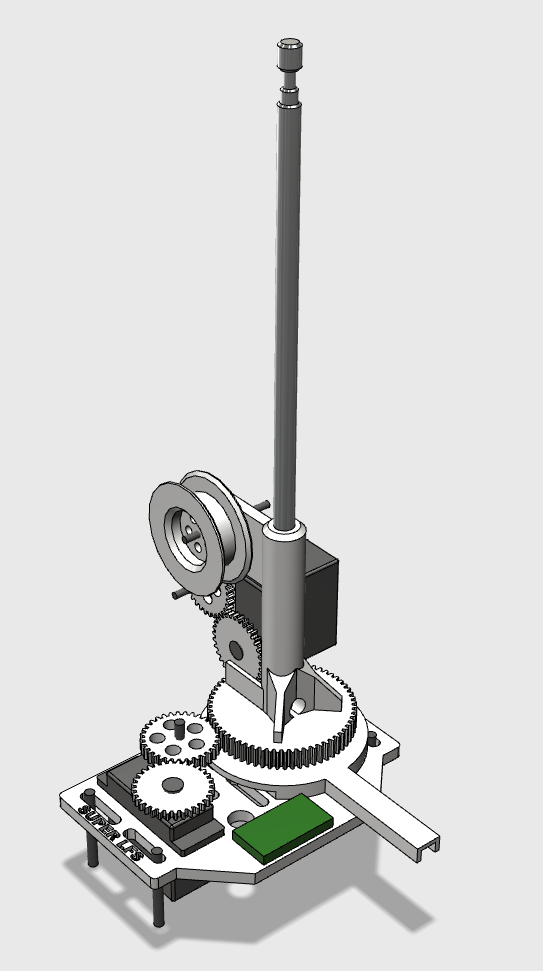

# LifeFormScanner
####  R2 Builders Group, [www.astromech.net](http://www.astromech.net)

Open source hardware and software designed to recreate the telescopic effect of R2-D2's iconic life form scanner from Empire Strikes Back. 

##### Please note, design and development of this lifter is still in progress. 

Bill of Materials (Purchased):
 *  22mm 6 Wire Slip Ring
 *  2x HiTec 422 Standard Servos
 *  1 Power Antenna Mast 
 *  1 Arduino
 *  1 SparkFun Low Voltage Current Sensor
 
Bill of Materials (3D Printed or Purchased via [Shapeways](http://www.link.to/storefront)):
 *  1 LFS Mast
 *  1 LFS Spool
 *  1 LFS Base Plate
 *  1 LFS Thick Gear
 *  2 LFS Thin Gears

